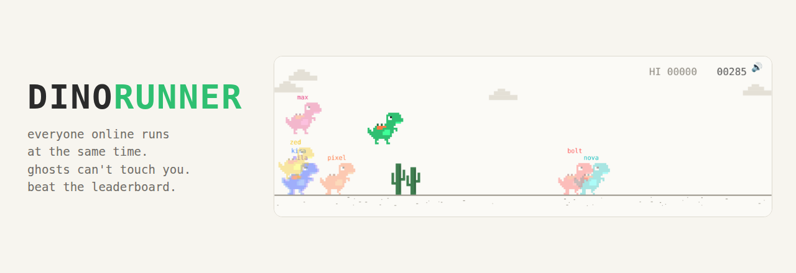

<p align="center"></p>

<p align="center">
  
  
  
  
</p>

# dinorunner

The offline dino game, but everyone who opens the link runs at the same time.

You only collide with your own cacti. Other players show up as see-through ghosts: the further someone is ahead of you, the further right they run. If they are way ahead or way behind, they turn into a tag on the edge of the screen. When someone crashes you see it, and their name gets crossed out in the list.

Best score of the day and of all time go to the leaderboard.

## Run it on your computer

Needs Node.js 18 or newer.

```bash
npm install
npm start
```

Open http://localhost:8080, type a name, press PLAY. Open a second tab to race yourself.

People on the same Wi-Fi can join with your local IP, for example http://192.168.0.12:8080.

| setting | default | what it does |
|---|---|---|
| `PORT` | 8080 | port for the page and the server |
| `MAX_CONN` | 600 | connections on the whole server |
| `MAX_PER_IP` | 4 | connections from one address |

## Put it online

Any host that runs Node and supports WebSockets works. On Render:

1. Push this folder to a GitHub repo.
2. On render.com: New, Web Service, pick the repo.
3. Build command `npm install`, start command `npm start`.
4. Open the `onrender.com` link it gives you and post it.

The leaderboard is saved to `data/leaderboard.json`. On the free Render plan the disk is wiped on every restart and redeploy, so the scores start over. Add a Render disk mounted at `data/` if you want them to stay.

## Controls

| key | action |
|---|---|
| Space or ↑ | jump, hold for a higher jump |
| ↓ | duck, or drop faster in the air |
| Enter | run again after a crash |
| M | sound on or off |

On a phone: tap the right side of the game to jump, hold the left side to duck.

## What is in a run

- Cacti in groups of one to three.
- Drones after 250 points. Low ones you jump, middle ones you duck under, high ones you just keep running.
- Speed goes up the whole time.
- Day turns to night every 700 points, a chime every 100.

## How it works

Every player runs their own world in the browser. Ten times a second the browser sends its score and the dino position, and the server sends everyone the list of who is running. That list is what draws the ghosts and the RUNNING NOW panel.

`public/rules.js` has the speed curve and is loaded by both sides. The server uses it to work out the highest score possible for how long you have been running, and cuts anything above that. Sending a fake score of 999999 three seconds into a run gets saved as about 40.

What keeps it up: messages over 1 KB are dropped, every connection is rate limited, names are cleaned, dead connections are closed after 15 seconds, slow clients are skipped instead of queued. `/health` returns how many are online, how many are running and the top score.

The page has `twitter:card` player tags that point at `/embed` on whatever domain serves it, so once it is on https the link can open as a playable card on X.

## Files

```
server.js          live list, leaderboard, static files
public/index.html  page, panels, overlay
public/game.js     the game
public/rules.js    speed curve, shared with the server
public/preview.png link preview image
```
